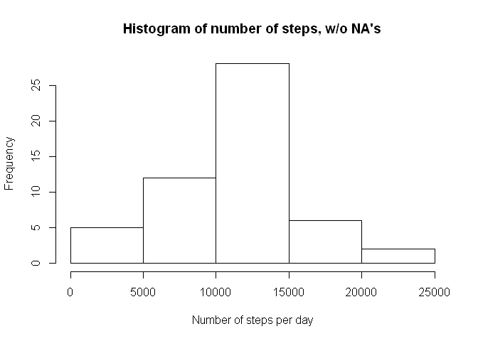
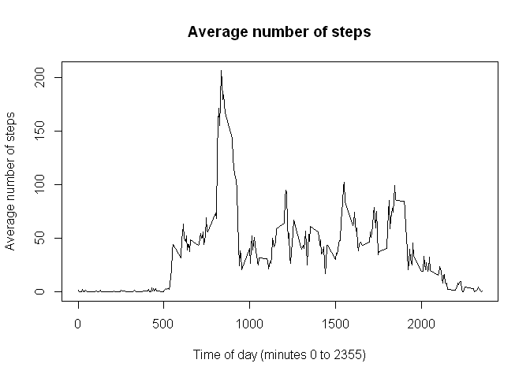
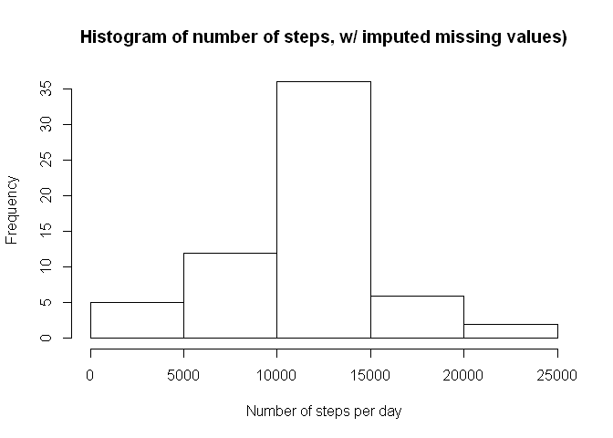
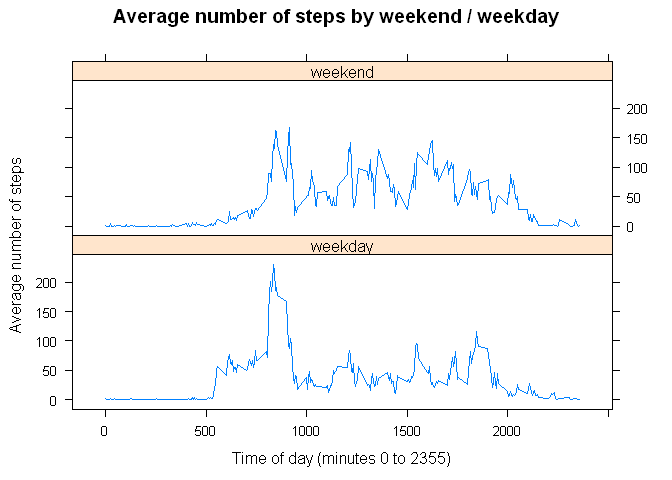

# Reproducible Research: Peer Assessment 1

This Report is the first Assignment of two in the Coursera.org class "Reproducible Research"


## Loading and preprocessing the data

First we read the date from a .csv file using the following commands:

```r
setwd("H:/My Documents/Coursera/05 Reproducible Research")
data <- read.csv("activity.csv")
```

We also need to the following packages to run the R code in this Report:

```r
library(sqldf)
library(lattice)
```


## What is mean total number of steps taken per day?

Now we will calculate the average steps per day and plot a Histogram:

```r
result1 <- sqldf("select date, sum(steps) TotalSteps 
                  from data  
                  where steps is not null 
                  group by date")

hist(result1$TotalSteps, main = "Histogram of number of steps, w/o NA's", 
     xlab = "Number of steps per day")
```

 

The average number of steps taken per day are 10766.19 steps and median number of steps taken per day are 10765 steps.


## What is the average daily activity pattern?

Now we want to see if there is a difference between different time interval during the day.  We calculate the average steps taken per every 5 minute interval and plot it:

```r
result <- sqldf("select interval, avg(steps) AverageSteps 
                 from data  
                 where steps is not null 
                 group by interval")

plot(result$interval, result$AverageSteps, type="l", main = "Average number of steps", 
     xlab = "Time of day (minutes 0 to 2355)", ylab = "Average number of steps")
```

 

The maximum number of steps were taken at 835 or 08:35


## Imputing missing values

The data has 2304 rows of missing steps (NA's) so now we will impute missing data by adding the average number of steps for that particular time period:

```r
data_wo_na <- sqldf("select case when a.steps is null 
                                then avg.AvgSteps
                                else a.steps
                            end steps,
                            a.date,
                            a.interval
                     from data a
                     join (select interval, avg(steps) AvgSteps 
                           from data  
                           where steps is not null 
                           group by interval) avg on avg.interval = a.interval
                    ")
```

Now our new dataset has 0 rows of NA's.  Now we use our new dataset to calculate the total number of step taken per day and plot a Histogram:

```r
result <- sqldf("select date, sum(steps) TotalSteps 
                 from data_wo_na  
                 group by date")

hist(result$TotalSteps, main = "Histogram of number of steps, w/ imputed missing values)", 
     xlab = "Number of steps per day")
```

 

Now with the new dataset the average number of steps taken per day are 10749.77 steps which is 16.4181874
steps less than
the one without the NA's.  The median number of steps taken per day are now 10641 steps which is 124
steps less than
the one without the NA's.


## Are there differences in activity patterns between weekdays and weekends?

Now create a new variable from the date, dayofweek, which is either "weekend" or "weekday" and then we calculate the average steps taken per 5 minute interval for weekend and weekday.  Finally we plot the result in two separate graphs:

```r
result <- sqldf("select date, interval, steps, 
                        case when strftime('%w', date) in ('0', '6') 
                            then 'weekend'
                            else 'weekday'
                        end dayofweek
                 from data_wo_na")

result2 <- sqldf("select dayofweek, interval, avg(steps) AvgSteps
                  from result
                  group by dayofweek, interval")

dayfactor <-factor(result$dayofweek) 

xyplot(AvgSteps ~ interval | dayofweek, data = result2, type = 'l', 
       main = "Average number of steps by weekend / weekday",
       xlab = "Time of day (minutes 0 to 2355)", ylab = "Average number of steps",
       layout = c(1, 2))
```

 
